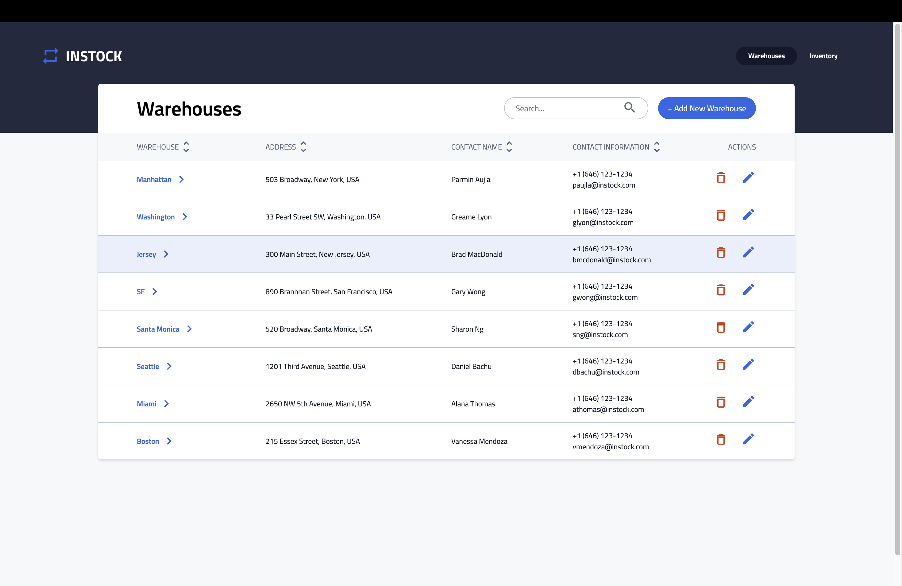
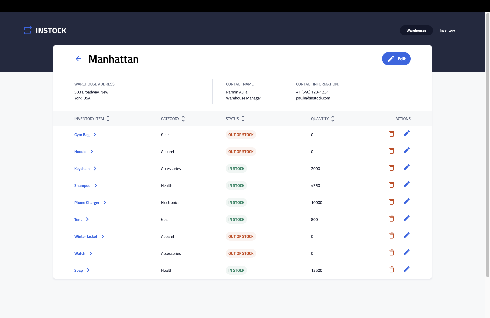
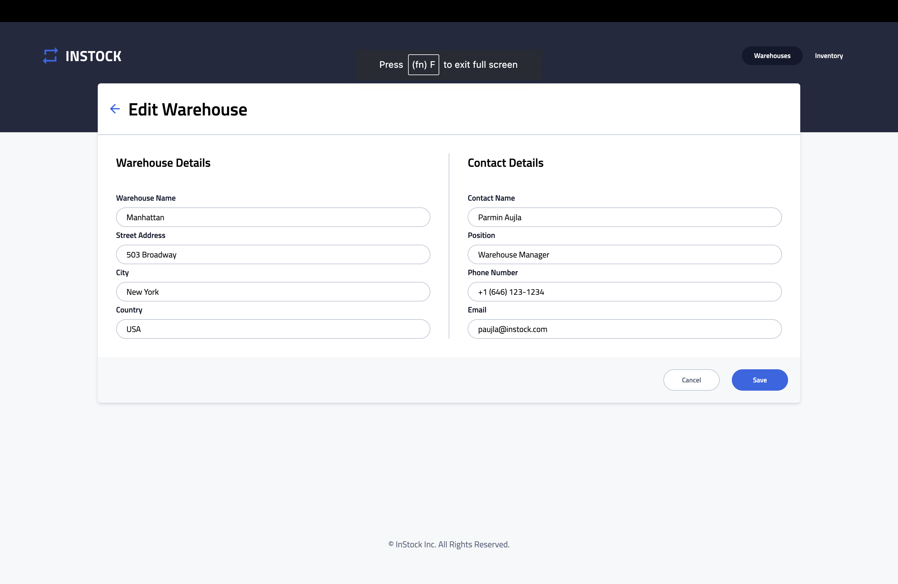
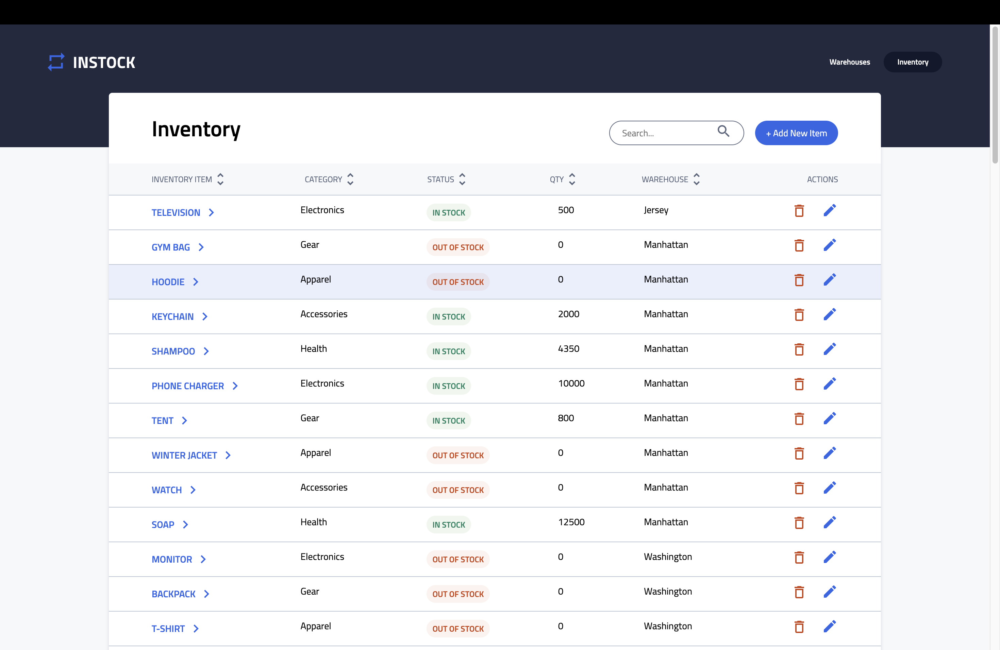
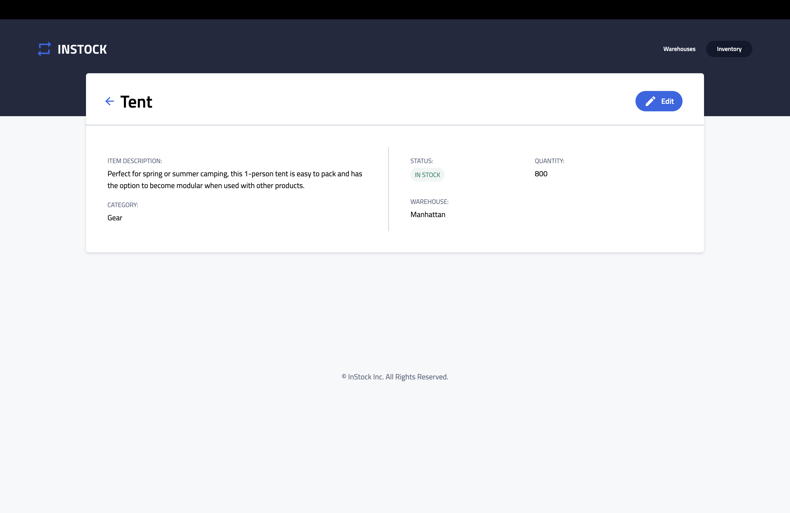
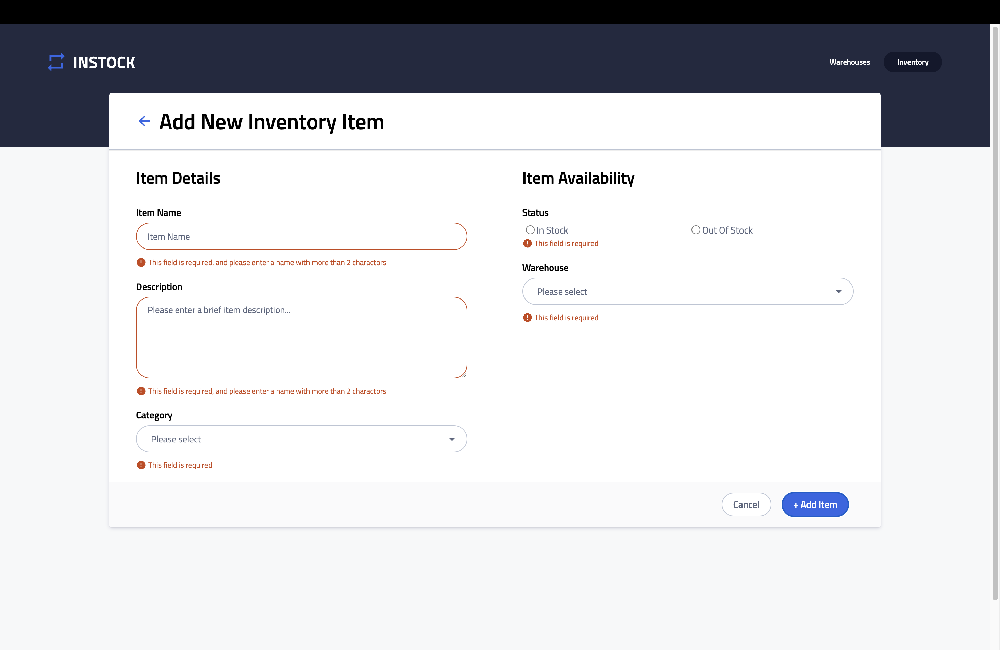
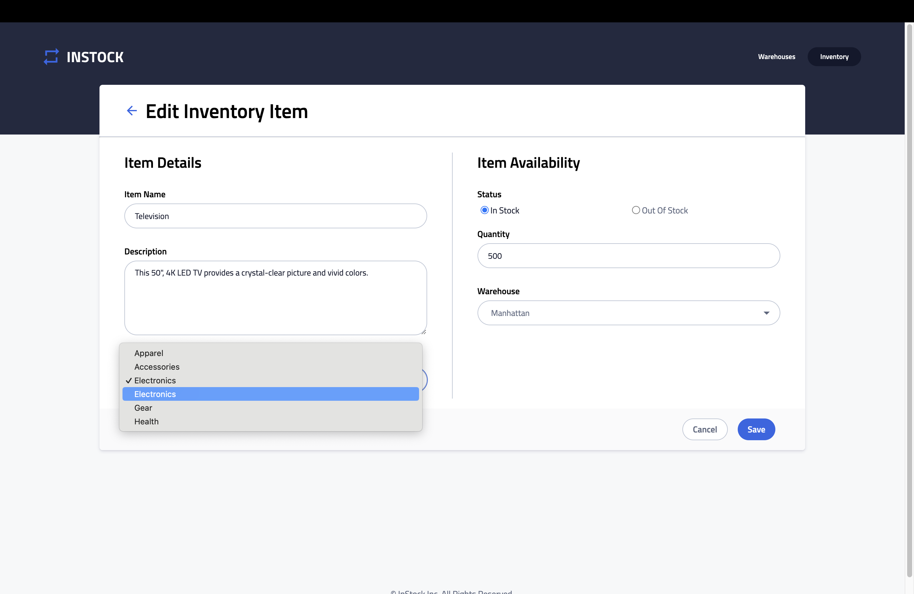

# Instock

Instock is a comprehensive web application crafted to streamline inventory and warehouse management. It utilizes React for a dynamic front-end experience and Node.js for robust back-end services. The application offers an intuitive and engaging interface, allowing users to efficiently manage and interact with their inventory data.

## Features

- List View of Warehouses
  

- List View of inventory items in a warehouse
  

- Edit warehouse Information
  

- List View of inventory items in a warehouse
  

- Inventory item detail
  

- Add an Inventory item with input validation
  

- Edit an Inventory item detail
  

## Getting Started

These instructions will get you a copy of the project up and running on your local machine for development and testing purposes.

### Prerequisites

What things you need to install the software and how to install them:

- Node.js
- Express.js
- npm or yarn
- knex
- mysql2

### Installing

A step-by-step series of examples that tell you how to get a development environment running:

1. Clone the client repository:
   ```bash
   git clone [https://github.com/Zijing-Liu/InStock-finch-client.git]
   ```
2. Clone the server repository:

   ```bash
   git clone [https://github.com/ghufran-adel/instock-finch-api.git]
   ```

3. Install all dependencies:
   ```bash
   npm install
   ```
4. Start the client in the client repo

   ```bash
   npm start
   ```

5. Navigate to the api repo and start the server:
   ```bash
   node index.js
   ```

## Acknowledgments

The project is affiliated with BrainStation, with BrainStation providing the project requirement, Figma design files, style guide and breakdown of Jira tickets.
